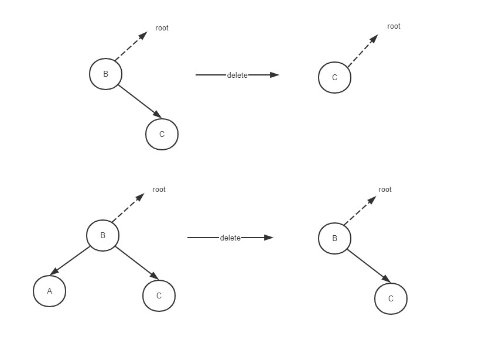
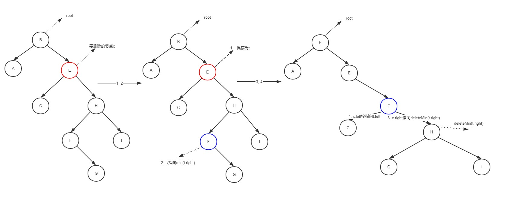

二叉查找树（BST）是一颗二叉树，也叫二叉搜索树，每个节点的键都大于其左子树的节点的键任意节点的键而小于右子树的任意。
<!--more-->

### 数据结构和实现方法

#### 数据结构
```

public class BST<Key extends Comparable<Key>, Value> {

    private Node root; //根节点

    class Node {
        private Key key;
        private Value value;
        private Node left, right;
        private int num; // 以改节点为根节点的子树的节点总数
    }  
}
```

#### 树的节点数量


```
public int size() {
    return size(root);
}
    
private int size(Node x) {
    if(x == null)
        return 0;
    return
        x.num;
}
```

#### 查找和插入

```
public Value get(Key key) {
    get(root, key);
}
    
private Value get(Node x, Key ley) {
    if(x == null)
        return null;
        
    int cmp = key.compareTo(x.key);
    
    if(cmp < 0)
        return get(x.left, key);
    else if (cmp > 0)
        return get(x. rigth, key);
            
    return x.value;
}
```


```
public void put(Key key, Value value) {
    root = put(root, key, value);
}

private Node put(Node x, Key key, Value value) {
    if(x == null)
        return new Node(key, value, 1);
        
    int cmp = key.compareTo(x.key);
    
    if(cmp < 0)
        x.left = put(x.left, key, value);
    else if(cmp > 0)
        x.right = put(x.right, key, value);
    else
        x.value = value;
        
    x.num = size(x.left) + size(x.right) + 1;
    
    return x;
}
```

二叉树插入时现判断key值，如果key和当前节点的键相等的话只要直接更新value即可，如果key小于当前节点的键，那么就要左子树中插入，反之在右子树插入。
在插入的同时要更新每个节点的num值，即上级节点的num全部加1。

#### 删除

在删除一个节点时，如果该节点只有没有子节点，那很方便，直接设置为null就行了，如果只有一个子节点的话，用该子节点替代自身即可。但是有连个子节点呢，被删除的父节点只空出一条链接，这个时候就要用4个步骤完成替换过程

1. 将即将被删除的节点x保存为t
2. 将x指向它的右子树中最小的节点min(t.right)
3. 将x的右链接指向 删除了最小节点min(t.right)后仍然都大于x.key的子节点deleteMin(t.right)
4. 将x的左链接设置为t.left


```
// 查询最小节点
public Key min() {
    return min(root);
}

private Key min(Node x) {
    if(x.left == null)
        return x;
    return x.left;
}


删除最小节点
public void deleteMin() {
    root = deleteMin(root);
}

private Node deleteMin(Node x) {
    if(x.left == null)
        return x.right;
    x.left = deleteMin(x.left);
    x.num = size(x.left) + size(x.right) + 1;
    
    return x;
}
```

上面的deleteMin ()方法可以看到，删除一颗二叉查找树的最小节点，如果该节点无左子树，那最小节点就是它本身，返回右节点即可，如果存在左子树，那么最小节点一定在它的左子树中，递归执行找出后设为空，然后对每个节点的num值修改，最终返回的还是该节点本身。所以就返回值来看，如果x不存在左子树，返回x.right，如果x存在左子树，返回x本身。


然后是整个二叉查找树的delete实现

```
public void delete(Key key) { 
    root = delete(root, key);
}

private Node delete(Node x, Key key) {
    if(x == null)
        return null;
        
    int cmp = key.compareTo(x.key);
    
    if(cmp < 0)
        x.left = delete(x.left, key, value);
    else if(cmp > 0)
        x.right = delete(x.right, key, value);;
    else {
        if(x.right == null)
            return x.left;
        if(x.left == null)
            return x.right;
            
        // 1. 将即将被删除的节点x保存为t
        Node t = x;
        // 2. 将x指向它的右子树中最小的节点min(t.right)
        x = min(t.right);
        3. 将x的右链接指向 删除了最小节点min(t.right)后仍然都大于x.key的子节点deleteMin(t.right)
        x.right = deleteMin(t.right);
        //4. 将x的左链接设置为t.left  x是t.right的最小节点，所以原本的x.left必定为null
        x.left = t.left;
    }
    
    x.num = size(x.left) + size(x.right) + 1;
    
    return x;
}
```



deleteMax()的删除和deleteMin()一样，只是左右相反
