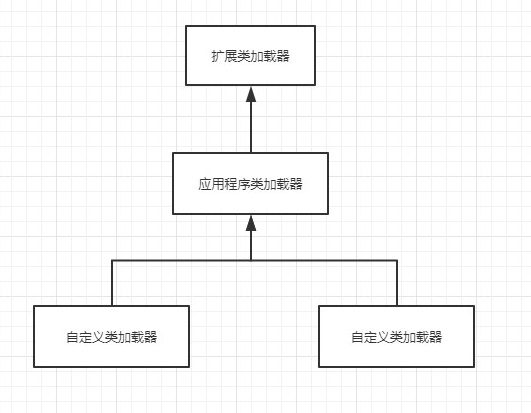

### 类与类加载器
比较两个类是否相等，只有在这两个类是有同一个类加载器加载的前提下才有意义，否则即便是来自同一个Class文件，被同一个虚拟机加载，只要加载它们的类加载器不同，那这两个类就不相等

### 双亲委派模型

从JVM角度，类加载器分为两种：一种是启动类加载器（Bootstrap ClassLoader），由C++实现是JVM的一部分，另一种就是其他所有的类加载器，有Java实现独立虚拟机外部

<!--more-->

从Java开发人员角度：
1. 启动类加载器（Bootstrap ClassLoader）：主要加载JVM自身工作需要的类，无法被Java程序直接引用，这个ClassLoader完全由JVM自己控制，需要加载哪个类怎么加载都有JVM自己控制，别人也无法访问这个类，所以ClassLoader仅仅是一个类的加载工具，没有更高一级的父加载器，也没有子加载器
2. 扩展类加载器（Extension ClassLoader）： 负责加载<JAVA_HOME>\lib\ext目录中的类，或者被java.ext.dirs系统变量所指定的路径中的所以类库，开发者可以直接使用扩展类加载器
3. 应用程序类加载器（Application ClassLoader）：这个类加载器是ClassLoader中的getSystemClassLoader()方法的返回值，所以一般也称它为系统类加载器，负责加载用户路径所指定的类库，开发者可以直接使用这个类加载器。如果程序没有自定义的类加载器，一般情况下这个就是默认的类加载器。

除此之外还可以加入自定义的类加载器

这样的类加载器之间的关系就是双亲委派模型

双亲委派模型要求除了顶级的启动类加载器之外，其余的类加载器都要有自己的父类加载器。 这里的类加载器之间的父子关系一般不会以继承关系来实现，儿都是用组合的关系来复用父加载器的代码

### 双亲委派的工作过程
如果一个类加载器收到了类加载的请求，会把这个请求委派给父类加载器去完成，每个层次的类加载器都是如此，最终所有的请求都会传到顶层的启动类加载器中，只有当父加载器无法完成加载请求时，子加载器才会尝试自己去加载