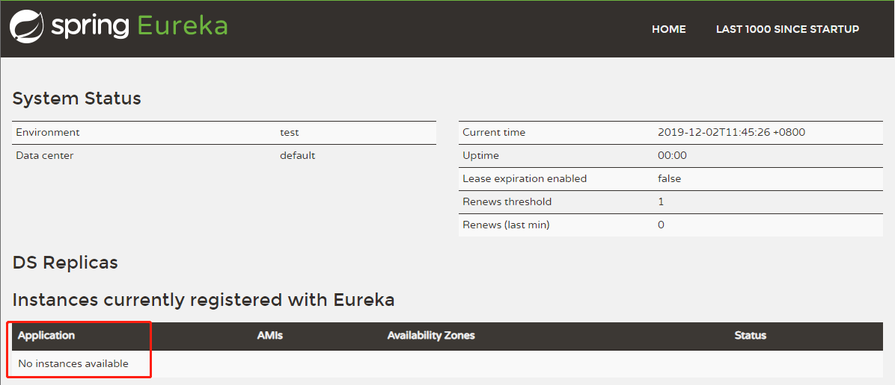
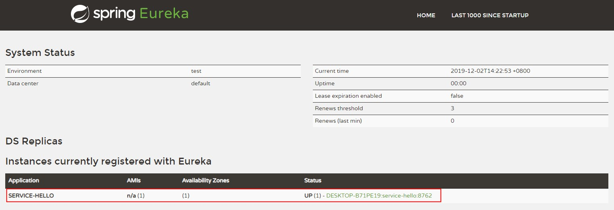

Eureka 是 Netflix 开发的，一个基于 REST 服务的，服务注册与发现的组件

它主要包括两个组件：Eureka Server 和 Eureka Client

- Eureka Client：一个Java客户端，用于简化与 Eureka Server 的交互（通常就是微服务中的客户端和服务端）
- Eureka Server：提供服务注册和发现的能力（通常就是微服务中的注册中心）

<!--more-->

各个微服务启动时，会通过 Eureka Client 向 Eureka Server 注册自己，Eureka Server 会存储该服务的信息也就是说，每个微服务的客户端和服务端，都会注册到 Eureka Server，这就衍生出了微服务相互识别的话题

- 同步：每个 Eureka Server 同时也是 Eureka Client（逻辑上的， 多个 Eureka Server 之间通过复制的方式完成服务注册表的同步，形成 Eureka 的高可用
- 识别：Eureka Client 会缓存 Eureka Server 中的信息，即使所有 Eureka Server 节点都宕掉，服务消费者仍可使用缓存中的信息找到服务提供者
- 续约：微服务会周期性（默认30s）地向 Eureka Server 发送心跳以Renew（续约）信息（类似于heartbeat）
- 续期：Eureka Server 会定期（默认60s）执行一次失效服务检测功能,它会检查超过一定时间（默认90s）没有Renew的微服务，发现则会注销该微服务节点


### Eureka Server


首先用IDEA创建一个主Maven工程，在其pom文件引入依赖，spring Boot版本为2.1.5.RELEASE，Spring Cloud版本为Greenwich.SR1。这个pom文件作为父pom文件，起到依赖版本控制的作用，其他module工程继承该pom。

pom文件如下：

```

  <modelVersion>4.0.0</modelVersion>
  <packaging>pom</packaging>

<!--  后续module子工程
  <modules>
    <module>cloud-eureka-client</module>
    <module>cloud-eureka-client1</module>
    <module>cloud-eureka-server</module>
    <module>cloud-server-ribbon</module>
    <module>cloud-server-feign</module>
    <module>cloud-service-zuul</module>
    <module>cloud-config-server</module>
  </modules>
-->

  <parent>
    <groupId>org.springframework.boot</groupId>
    <artifactId>spring-boot-starter-parent</artifactId>
    <version>2.1.5.RELEASE</version>
    <relativePath/> <!-- lookup parent from repository -->
  </parent>

  <name>cloud</name>
  <groupId>pers.hogwarts</groupId>
  <artifactId>cloud</artifactId>
  <version>1.0-SNAPSHOT</version>


  <properties>
    <java.version>1.8</java.version>
    <spring-cloud.version>Greenwich.SR1</spring-cloud.version>
  </properties>

  <dependencies>

    <dependency>
      <groupId>org.springframework.boot</groupId>
      <artifactId>spring-boot-starter-web</artifactId>
    </dependency>

    <dependency>
      <groupId>org.springframework.boot</groupId>
      <artifactId>spring-boot-starter-test</artifactId>
      <scope>test</scope>
    </dependency>

  </dependencies>


  <dependencyManagement>
    <dependencies>
      <dependency>
        <groupId>org.springframework.cloud</groupId>
        <artifactId>spring-cloud-dependencies</artifactId>
        <version>${spring-cloud.version}</version>
        <type>pom</type>
        <scope>import</scope>
      </dependency>
    </dependencies>
  </dependencyManagement>

  <build>
    <plugins>
      <plugin>
        <groupId>org.springframework.boot</groupId>
        <artifactId>spring-boot-maven-plugin</artifactId>
      </plugin>
    </plugins>
  </build>


```

新建module工程，选择 spring initializr -> 下一步 -> cloud discovery -> eureka server创建完成后pom文件继承父pom文件并引入Eureka Server依赖

```

    <modelVersion>4.0.0</modelVersion>

    <parent>
        <groupId>pers.hogwarts</groupId>
        <artifactId>cloud</artifactId>
        <version>1.0-SNAPSHOT</version>
    </parent>


    <artifactId>cloud-eureka-server</artifactId>
    <version>0.0.1-SNAPSHOT</version>
    <name>cloud-eureka-server</name>
    <description>Demo project for Spring Boot</description>

    <dependencies>
        <dependency>
            <groupId>org.springframework.cloud</groupId>
            <artifactId>spring-cloud-starter-netflix-eureka-server</artifactId>
        </dependency>
    </dependencies>


```

启动一个服务中心，只要在启动类加上@EnableEurekaServer即可

```

@EnableEurekaServer
@SpringBootApplication
public class CloudEurekaServerApplication {

    public static void main(String[] args) {
        SpringApplication.run(CloudEurekaServerApplication.class, args);
    }

}

```


eureka是一个高可用的组件，它没有后端缓存，每一个实例注册之后需要向注册中心发送心跳（因此可以在内存中完成），在默认情况下Eureka Server也是一个Eureka Client ,必须要指定一个Server。配置文件：

```

server:
  port: 8761

eureka:
  instance:
    hostname: localhost
  client:
    registerWithEureka: false
    fetchRegistry: false
    serviceUrl:
      defaultZone: http://${eureka.instance.hostname}:${server.port}/eureka/

```

eureka.client.registerWithEureka: false表示自己是一个Eureka Server。

启动工程， 打开浏览器输入 localhost:8761可以看到界面如下：


因为目前没有Eureka Client注册到Server所以Application是No instances available


### Eureka Client

新建一个module子模块

pom如下
```

    <modelVersion>4.0.0</modelVersion>

    <parent>
        <groupId>pers.hogwarts</groupId>
        <artifactId>cloud</artifactId>
        <version>1.0-SNAPSHOT</version>
    </parent>

    <artifactId>cloud-eureka-client</artifactId>
    <version>0.0.1-SNAPSHOT</version>
    <name>cloud-eureka-client</name>
    <description>Demo project for Spring Boot</description>


    <dependencies>
        <dependency>
            <groupId>org.springframework.cloud</groupId>
            <artifactId>spring-cloud-starter-netflix-eureka-client</artifactId>
            <version>2.1.1.RELEASE</version>
        </dependency>
    </dependencies>


```

通过注解@EnableEurekaClient 表明自己是一个Eureka Client

```

@SpringBootApplication
@EnableEurekaClient
@RestController
public class CloudEurekaClientApplication {

    public static void main(String[] args) {
        SpringApplication.run(CloudEurekaClientApplication.class, args);
    }

    @Value("${server.port}")
    String port;

    @RequestMapping("/hello")
    public String hello(@RequestParam String name) {
        return "hello "+name+",i am from port:" +port;
    }

}

```

除此之外，还要配置服务注册中心地址
```

eureka:
  client:
    serviceUrl:
      defaultZone: http://localhost:8761/eureka/
server:
  port: 8762
spring:
  application:
    name: service-hello

```

启动工程， 打开浏览器输入 localhost:8761可以看到界面如下：



可以看到新建的工程已经注册到Eureka Server中了，服务名为SERVICE-HELLO