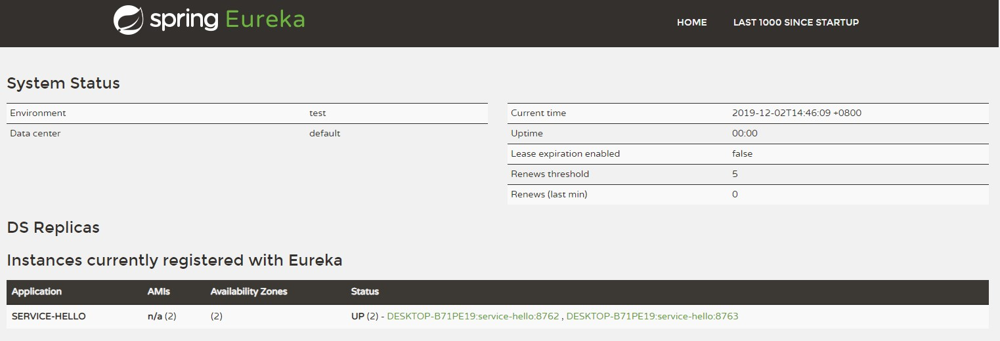
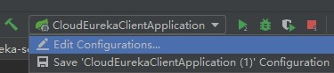
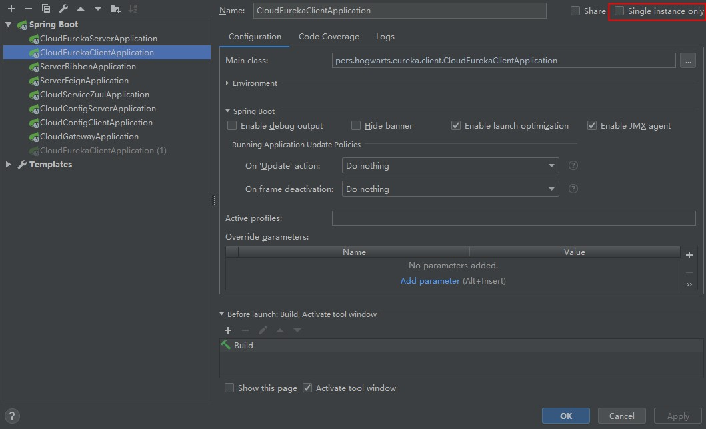
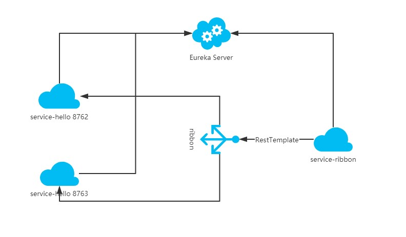

Spring Cloud Ribbon是一个基于HTTP和TCP的客户端负载均衡工具，它基于Netflix Ribbon实现。通过Spring Cloud的封装，可以让我们轻松地将面向服务的REST模版请求自动转换成客户端负载均衡的服务调用。

<!--more-->

### 准备工作

把service-hello工程复制一份，把端口改成8763，启动工程能看到有service-hello工程在Eureka Server注册了两个实例



不想复制的也可以通过配置IDEA启动多个实例




去除 Single instance only 勾选，修改项目端口就可以启动新的实例




### 建立Ribbon消费者

新建一个module子工程，继承父pom文件并引入依赖：

```

    <modelVersion>4.0.0</modelVersion>

    <parent>
        <groupId>pers.hogwarts</groupId>
        <artifactId>cloud</artifactId>
        <version>1.0-SNAPSHOT</version>
    </parent>


    <artifactId>cloud-server-ribbon</artifactId>
    <version>0.0.1-SNAPSHOT</version>
    <name>cloud-server-ribbon</name>
    <description>Demo project for Spring Boot</description>


    <dependencies>
        <dependency>
            <groupId>org.springframework.cloud</groupId>
            <artifactId>spring-cloud-starter-netflix-ribbon</artifactId>
            <version>RELEASE</version>
        </dependency>
    </dependencies>


```

配置项如下：
```

eureka:
  client:
    serviceUrl:
      defaultZone: http://localhost:8761/eureka/
server:
  port: 8764
spring:
  application:
    name: service-ribbon

```


向程序的ioc注入一个bean: restTemplate;并通过@LoadBalanced注解表明这个restRemplate开启负载均衡的功能

```

@SpringBootApplication
@EnableEurekaClient
public class ServerRibbonApplication {

    public static void main(String[] args) {
        SpringApplication.run(ServerRibbonApplication.class, args);
    }


    @Bean
    @LoadBalanced
    public RestTemplate restTemplate() {
        return new RestTemplate();
    }
}

```


写一个测试类HelloService来消费service-hello中的hello方法，在程序里用服务名来代替具体的URL，ribbon会根据服务名调用URL，然后写一个controller对外暴露接口


```

@Service
public class HelloServiceImpl {

    @Autowired
    private RestTemplate restTemplate;

    @Override
    public String hello(String name) {
        return restTemplate.getForObject("http://service-hello/hello?name="+name,String.class);
    }
}


@RestController
public class HelloController {

    @Autowired
    private HelloService helloService;


    @RequestMapping(value = "/hello")
    public String hello(@RequestParam String name){
        return helloService.hello(name);
    }
}


```

启动工程， 打开浏览器输入 localhost:8764/hello?name=ribbon 多次访问可以看到浏览器交替显示

> hello ribbon,i am from port:8762

> hello ribbon,i am from port:8763

这说明ribbon已经做了负载均衡

### 架构图
